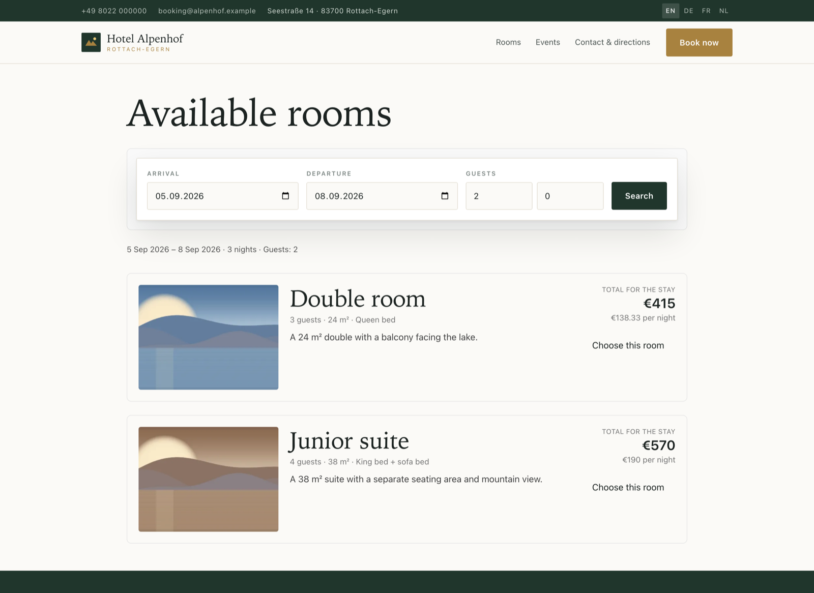
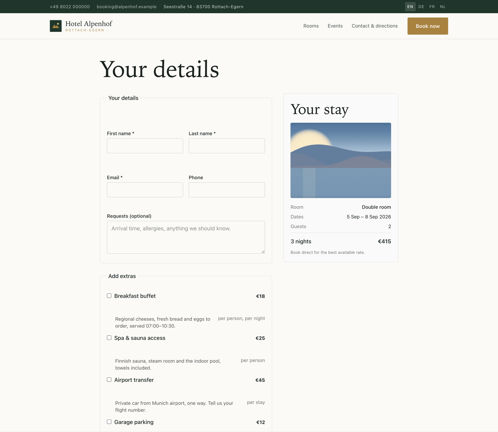
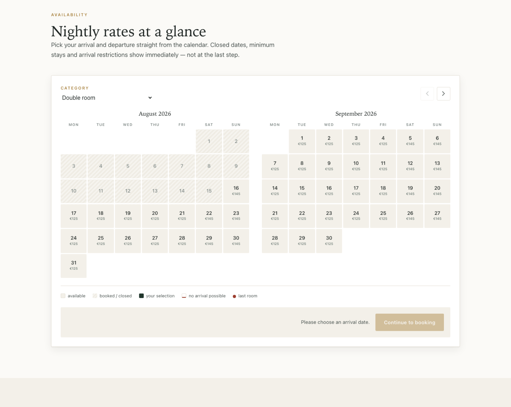

# Doba — direct-booking engine and website for independent hotels

[](https://github.com/gumslone/doba/actions/workflows/ci.yml)
[](LICENSE)
[](https://codespaces.new/gumslone/doba)

**Doba** is an open-source hotel booking system built on Laravel: a public,
multilingual, server-rendered website with a direct-booking engine, an
availability calendar, rate and restriction rules, online payments, OTA/channel
sync and a full admin panel.

It exists for one reason. An independent hotel pays Booking.com, Expedia or
Airbnb 15–18% commission on every reservation. A direct-booking site takes that
back — but only if it *ranks* and *converts*, which is why the SEO layer here is
a first-class subsystem rather than a meta tag bolted on at the end.

*doba* is the everyday word for one hotel night in Polish and Ukrainian.

> **Status: in progress.** Built so far: the multilingual SEO layer, the
> availability & rate engine, the booking core (holds, locking, state
> machine), **online payments** (Stripe, PayPal, LiqPay, crypto, manual),
> events, extras & room inclusions, photo management with a maps block,
> invoices, **two-way iCal channel sync**, the guest booking funnel, and an
> interim admin with a WYSIWYG editor.
> Still to come: the installation wizard, the public partner API and the full
> Filament panel — all specified in
> [`docs/architecture.md`](docs/architecture.md). See [Roadmap](#roadmap).
> The correctness-critical paths are covered by 285+ tests on both database
> engines, but the platform has not yet run a real hotel — treat it as
> pre-release.

---

## Screenshots

The demo hotel below is what `migrate --seed` produces — real rooms, rates,
events and four languages, rendered by the default theme.

| | |
|---|---|
| [](docs/screenshots/home.png)<br>**Home** — hero, rooms with "from" prices, upcoming events | [](docs/screenshots/rooms.png)<br>**Rooms** — the room list with occupancy and rates |
| [](docs/screenshots/room-detail.png)<br>**Room detail** — grouped inclusions, optional extras, `HotelRoom` + `Offer` schema | [](docs/screenshots/events.png)<br>**Events** — dated happenings with `Event` schema |
| [](docs/screenshots/contact.png)<br>**Contact** — enquiry form, plus the click-to-load map | [](docs/screenshots/booking-search.png)<br>**Booking search** — live availability and stay totals |
| [](docs/screenshots/booking-checkout.png)<br>**Checkout** — guest details, extras, consent, live summary | [](docs/screenshots/calendar.png)<br>**Availability calendar** — two months, per-night prices, restrictions |

<sub>The photographs are generated by the demo seeder, not stock imagery — a
public repository can't ship licensed hotel photography, and a site with no
images hides every image bug. Replace them from **Admin → Photos**.</sub>

## Why this exists

| | Booking.com | A generic website builder | Doba |
|---|---|---|---|
| Commission per booking | 15–18% | 0% | 0% |
| Real availability & rates | ✅ | ❌ | ✅ |
| Ranks for "hotel *in your town*" | for *them* | maybe | that is the point |
| Guest data is yours | ❌ | ✅ | ✅ |
| Runs on €5/month hosting | — | — | ✅ (SQLite mode) |

---

## What is built today

### SEO layer

Everything below is implemented and covered by tests.

- **Per-locale URLs with translated path segments *and* translated slugs** —
  `/de/zimmer/doppelzimmer` and `/en/rooms/double-room` resolve to the same room
  type. The slug lives in the translation table, never on the parent record.
- **Reciprocal `hreflang` + `x-default`**, emitted in the page head *and* in the
  sitemap. A record that is translated into three of four languages gets exactly
  three alternates — a fallback-rendered page is never advertised as a
  translation.
- **Self-referencing canonical URLs**, query strings excluded, so `?utm_source=`
  cannot fork a page into a second indexable URL.
- **JSON-LD structured data**: `Hotel` (address, geo, amenities, check-in
  times), `HotelRoom`, `Offer` with price/currency/availability/validity,
  `BreadcrumbList`, `ItemList`, `WebSite`, `FAQPage`. Money is stored in integer
  minor units and converted at the boundary, so a €125 room is never published
  as `12500`.
- **Editable, translated FAQs** rendered on the home page with matching
  `FAQPage` markup — the structured data never describes questions the page
  doesn't visibly show.
- **Translated amenities** per room type, rendered on the room page and
  mirrored as `LocationFeatureSpecification` entries in the room's JSON-LD.
- **Room inclusions, grouped** — WiFi, walk-in shower, bathtub, hairdryer,
  balcony and the rest arrive under *Room / Bathroom / Comfort / View*
  headings rather than as one flat wall of ticks, because a guest arrives
  with a specific question ("shower or bath?") and skims past a wall.
- **The counters are audited nightly.** `availability.booked` and `held`
  are caches of the booking tables, and `availability:reconcile` is the job
  that proves it — recomputing both from ground truth (one row per unit per
  night for bookings whose status declares the `booked` side, plus every
  OTA block still holding, plus unreleased holds) and reporting every
  disagreement. **Both directions are reported, and the quiet one is why
  this exists**: overselling announces itself when a guest reaches the desk,
  but a counter stuck *high* silently stops the hotel selling a room it
  actually has, and nothing anywhere looks broken. It exits non-zero even
  after `--fix`, because drift means a bug already happened and a reconcile
  that repairs it and exits 0 is a bug nobody ever hears about.
- **Search does not slow down as the hotel grows.** A twenty-room property
  that lists its rooms individually — a villa, a boutique where every room
  differs — used to issue **216 queries for one search**, because each room
  type asked the same questions and each re-read the same nights. The
  nights and the rate plans are now loaded once per search: **12 queries,
  flat**, whether the hotel has three room types or thirty. The preload is
  scoped to the single call and released in a `finally`, never memoised for
  the request — a cache of availability that outlives the operation it was
  built for is one that can be read after somebody's booking changed it.
- **Bookable extras** — breakfast, spa & sauna, airport transfer, parking,
  a cot, late checkout — each priced *per stay, per night, per person or
  per person-night*, which is the difference between a €45 transfer and a
  €108 breakfast on the same three-night booking. Extras carry their own
  VAT rate (accommodation is usually reduced, breakfast and parking are
  not), can be scoped to particular room types or offered house-wide, and
  can be marked **included** so the pool shows as a perk rather than a
  price. Prices are snapshotted onto the booking like every other amount.
- **Contact form with enquiry storage** on a translated route (`/de/kontakt`,
  `/en/contact`): honeypot + timing check (spam is stored under its own
  status, never silently dropped, and the response never reveals detection),
  per-IP rate limiting, optional stay dates for quote requests, and a queued
  mail to the hotel inbox with reply-to set to the guest.
- **XML sitemap** with per-URL `xhtml:link` alternates, written nightly by
  `php artisan doba:sitemap` and generated live as a fallback.
- **`robots.txt` from the same flag as the meta robots tag** — a staging install
  cannot be `noindex` in HTML and crawlable in `robots.txt` at the same time.
  Crawlers are kept out of the booking funnel, where crawling would manufacture
  inventory holds.
- **Legacy-URL redirects** from a database table, resolved on 404 (no query on
  the happy path) and preserving the query string, so a hotel migrating from an
  old site keeps its rankings and its campaign attribution.
- **Core Web Vitals defaults**: intrinsic `width`/`height` on every image to
  prevent layout shift, WebP `srcset`/`sizes` capped at the source's real width,
  eager + `fetchpriority=high` on the LCP image and lazy on everything else,
  no third-party origins in the critical path.
- **Photo management** for every room type and the house gallery: uploads are
  stored under a random name, measured, and turned into WebP derivatives at
  upload time (never on the visitor's request); per-locale alt text; exactly
  one cover, always — deleting the cover promotes the next photo, and deleting
  a photo removes its derivatives with it.
- **Google Maps, click-to-load.** Nothing is requested from Google until the
  visitor presses the button, so the map costs no third-party request on
  arrival and the privacy policy stays short. `hasMap` and `GeoCoordinates`
  go into the `Hotel` structured data either way.
- **Events** with per-locale slugs (`/de/veranstaltungen/weinverkostung`),
  an upcoming-events section on the front page, and `schema.org/Event`
  markup with the hotel as the default venue — one of the few SERP features
  an independent hotel can win that an OTA listing cannot.
- **A visible breadcrumb trail that matches the structured one**, a language
  switcher that points at the current page in each language rather than the home
  page, and one `<h1>` per page.

### Booking engine

- **Availability** as one row per room type per night, with a raw-DDL `CHECK`
  constraint (`booked + held <= allotment`) as the last line of defence
  against overselling on both MySQL and SQLite.
- **Correct restriction handling**: min/max-stay and closed-to-arrival on the
  arrival night only, closed-to-departure on the checkout night only,
  `min_stay_through`, occupancy limits, multi-room composition. A missing row
  is unbookable, never "assume available".
- **Rate resolution**: per-date override → season rate (priority + weekday
  bitmask) → default rate, then the chosen **rate plan's** adjustment —
  frozen per night into the booking so a confirmed price never moves.
- **Rate plans**: flexible, non-refundable saver, early bird, long stay.
  Each carries eligibility (nights, days-before-arrival, a validity window
  bounded by the *stay*), a percent (basis points) or fixed adjustment
  applied **per night**, and its own cancellation terms. A plan posted for
  a stay it is not eligible for is ignored rather than honoured — a
  discount cannot be bought by editing a form field.
- **The cancellation policy is snapshotted onto the booking** in the
  guest's own language at booking time, per room because a booking may mix
  plans. Refunds are computed from that snapshot, never from the live
  plan: a dispute is settled by the wording the guest agreed to, and
  editing the plan afterwards cannot change what a taken booking owes.
- **Double-booking prevention** via `lockForUpdate` inside the booking
  transaction — and on SQLite via a mandatory `BEGIN IMMEDIATE` connection so
  concurrent bookings genuinely serialise rather than throwing `SQLITE_BUSY`.
  The concurrency test proves exactly one of two racers wins.
- **Holds & a state machine** where inventory is released by the status being
  *entered*, so no path can leak a unit; expired holds are swept every minute.
- An **admin availability grid** (§12): room types as rows, the month's
  dates as columns, each cell showing the *resolved* nightly price — the
  one a guest is quoted, not just manual overrides — and how many rooms
  are still free. Drag across cells to fill the bulk-edit panel, which
  applies a price, min/max stay, allotment or stop-sell across a date
  range and a weekday filter: "Saturdays in July, min-stay 3" is one
  operation, not thirty-one. Fields left blank are left alone, and the
  allotment can never be cut below what is already sold — the night is
  named rather than the constraint throwing a driver error.
- A public **two-month availability calendar** on the home and room pages:
  per-night prices, hatched closed dates, closed-to-arrival marks, a
  last-room dot, and range selection that applies the same N-vs-B
  boundary and arrival-date min-stay rules the server enforces — so the
  guest is never offered a range the engine would refuse. It hands off to
  the real checkout, which re-validates.
- **The complete guest funnel**: search → checkout → hold → pay →
  confirmation, plus a no-login **manage link** (40-character token,
  constant-time compared) where the guest can view or cancel their own
  booking. Availability is re-checked at checkout rather than trusted from
  the results page, a room taken mid-typing sends the guest back to search
  with an explanation instead of an error, and the whole funnel is
  `noindex` because crawling it would manufacture holds against real
  inventory. Scarcity ("only 2 left") is counted from confirmed bookings
  only, and only once units have genuinely sold.

### Payments

- A `PaymentGateway` contract with **Stripe**, **PayPal**, **LiqPay**
  (Ukraine/PrivatBank), **Coinbase Commerce** (crypto) and a **manual**
  (bank-transfer / pay-on-arrival) implementation — all over Laravel's HTTP
  client, no SDK dependencies, fully faked in tests.
- **The webhook is the source of truth, never the browser redirect.** Every
  handler verifies the provider's signature (and fails *closed* if the signing
  secret is unset), is idempotent on the gateway payment id, and re-acquires
  inventory under lock before confirming.
- **The late-webhook trap is handled**: a payment that lands after the hold
  expired and the room was resold is auto-refunded (or, for crypto that can't
  refund via API, released and flagged for a manual refund) — never confirmed
  into an overbooking.
- Partial and full **refunds** with correct `paid_amount` / `balance_due`
  bookkeeping; refunds are their own rows so the ledger reconstructs a dispute.
- **Restaurant, bar & the menu** — one `venues` table covering restaurant,
  bar, café and lounge, each with sections and dishes, all translated, on
  their own localised URLs (`/en/dining/seehof`, `/de/gastronomie/…`).
  Prices are minor units like every other amount and are **nullable**,
  because "market price" is a real menu entry and printing €0.00 for the
  day's catch is worse than printing nothing. Dishes carry the **fourteen
  allergens EU Regulation 1169/2011 requires a food business to declare**,
  as a fixed enum rather than free text — "nuts", "Nüsse" and "may contain
  traces of nuts" typed by three chefs are not searchable, translatable, or
  trustworthy to a guest whose reaction is measured in minutes. They print
  as the numbers a German or Austrian menu uses, ascending, with a key
  listing **only the allergens that card actually uses**. A dish with *no*
  allergen data is never presented as free of anything: an empty list may
  mean "contains none" or "nobody filled this in", and only one of those is
  safe to tell a guest with an allergy. Opening hours are two periods a day
  (a kitchen closes between lunch and dinner) and **wrap past midnight**, so
  a bar open 16:00–01:00 shows as open at half past midnight. The whole menu
  is published as schema.org `Restaurant`/`BarOrPub` → `Menu` → `MenuSection`
  → `MenuItem` with offers, diets and `openingHoursSpecification` — this is
  the one hotel page a search engine will render as structured content, and a
  market-price dish carries no `Offer` rather than a zero a search engine
  would repeat.
- **Promo codes** — percentage (stored in basis points, so no float ever
  touches the money path), fixed amount, or free nights with the **cheapest
  nights discounted first**, which is both what a guest reads into "your
  third night is free" and what costs the hotel least to honour. Codes carry
  minimum nights and total, separate *usable* and *arrival* date windows,
  total and per-guest usage limits, and a room-type restriction. Two rules
  keep them honest: a code discounts **the stay, never the extras** (the
  transfer is bought at its listed price), and the discount can never exceed
  the subtotal — a €200 code on a €150 stay is €150 off, not a refund the
  hotel now owes. The limit is re-checked **under lock inside the booking
  transaction**, because "50 uses" means 50 and two checkouts finishing in
  the same second must not both be the fiftieth. Cancelling a booking
  **gives the use back** while keeping the redemption row: a hundred
  abandoned holds must not retire a campaign, and a code that ran out has to
  stay explainable afterwards. A rejected code sends the guest back with the
  actual reason — "this code needs a longer stay" changes their dates,
  "invalid code" sends them to a competitor.
- **Invoices, with the VAT arithmetic done the way tax authorities expect.**
  A confirmed booking issues a sequentially numbered invoice (`2026-0001`,
  restarting each year, claimed under a locking read so two simultaneous
  confirmations cannot share a number) and the PDF is attached to the
  confirmation mail. Two rules make the figures trustworthy: VAT is
  **extracted** from the gross price rather than added to it — every amount
  the guest was ever shown already included it, so adding it would quietly
  bill them more than they agreed to — and **net is rounded while tax is the
  remainder**, so `net + tax` equals the gross exactly on every line and
  therefore on every total. The document prints the **per-rate breakdown** a
  German, Polish or Ukrainian invoice is required to show, because
  accommodation is reduced-rate while breakfast, parking and the spa are not.
  PDFs are rendered with Dompdf (not Browsershot: no headless Chromium on a
  hotel's server) onto the **private** disk and served only through the
  admin session or the guest's own manage-link token — an invoice carries a
  name and a home address, and sequential numbers make a public URL trivially
  enumerable. The schema refuses to delete a booking that has been invoiced.

### Channel sync (§9)

Tier-1 two-way iCal, which is what an independent hotel actually runs.

- **Export**: `GET /ical/{room_type}/{token}.ics` publishes every night the
  room cannot be sold, merged into as few `VEVENT`s as possible and built
  from `availability` rather than from bookings — a night closed by the
  hotelier, sold direct or held by another channel all export identically,
  because the OTA needs "not for sale", not why. The feed carries **no
  guest data at all**: it is a subscription URL, fetched by whoever ends up
  with it.
- **Import**: `channels:sync` runs every 15 minutes, matches events on their
  `UID` so a re-import is a no-op, and increments the same `booked` counter
  a direct booking uses — under the same lock and the same CHECK
  constraint, because an OTA guest occupies the room exactly as a direct
  guest does. `DTEND` is read as **exclusive**, so the checkout night stays
  sellable; reading it as the last night silently burns a night on every
  imported booking.
- **Removals get a guard, because they are the dangerous direction.**
  Adding a spurious block costs one unsold night. Releasing a block that
  was never cancelled sells a room an OTA has already promised, and the
  hotel finds out when the guest arrives. So a removal must clear three
  hurdles: the feed must have **parsed completely** (a truncated response
  returns `null`, never an empty event list — a 200 carrying half a
  calendar must not look like a quiet week), its **event count must be
  plausible** against the last sync (40 → 38 is two cancellations, 40 → 3
  is a truncated download), and the event must be **absent from three
  consecutive good syncs**. A stay starting **within 7 days is never
  auto-released** — it is flagged for staff, who release or keep it from
  the admin queue.
- **Staleness is itself an alert.** A feed with three consecutive errors or
  no success in an hour is logged at error level and shown in red in the
  admin: a dead sync and a quiet week look identical until two guests
  arrive for one room.
- **The import URL cannot be pointed at your own network.** It comes from a
  form, so the fetcher resolves the host and refuses private, loopback and
  link-local addresses — an admin session is the first thing an attacker
  gets, and a URL fetcher that will follow `http://169.254.169.254/` on
  request is an SSRF hole regardless of who filled the form in.
- **The limitation is stated in the admin UI, not just here**: iCal syncs
  availability only, with a 15–60 minute lag, and cannot push prices. Two
  guests can still book the last room on two channels inside that window.

### Security (§14)

- **No `unsafe-eval`, and therefore no expression-evaluating front-end
  framework.** Alpine compiles its bindings with `new Function()`, so a
  strict CSP disables it silently; the three interactive pieces (calendar,
  click-to-load map, cookie notice) are plain DOM instead. A test asserts
  the policy still forbids eval and that no template reintroduces such
  directives — the server-side suite cannot catch this by running.
- Response headers on every route: CSP, `X-Content-Type-Options`,
  `X-Frame-Options`, `Referrer-Policy`, `Permissions-Policy`, and HSTS over
  HTTPS.
- HTTPS forced in production so canonical URLs and redirects never emit
  `http://`; secure-cookie and CSRF handling; webhook routes are CSRF-exempt
  but signature-authenticated instead.
- Public forms carry a honeypot + timing check and per-IP rate limits; admin
  login is throttled. Money is integer minor units end to end.
- The branch ships with an adversarial security review on record (fail-open
  webhook verification found and fixed before merge).

### Platform

- Locale resolution: URL prefix → session → `Accept-Language` → `APP_LOCALE`,
  with an optional prefix-less default locale (the prefixed form then 301s).
- Two-layer translation: interface strings in `lang/`, content in
  `*_translations` tables edited by the hotelier.
- Theme layer — `resources/views/themes/<slug>` overrides `default` file by
  file; branding is *settings*, not theme files.
- Settings service cached across requests, exposed to every view as `$hotel`.
- Portable schema: identical migrations on **MySQL 8** and **SQLite 3.35+**,
  money as `bigInteger` minor units, no `ENUM`, no stored procedures.

---

## Requirements

- PHP 8.4+ with `pdo_mysql`, `pdo_sqlite`, `mbstring`, `intl`, `gd`, `zip`,
  `curl`, `openssl` — 8.4 is a hard floor: the SQLite `BEGIN IMMEDIATE`
  transaction mode the booking engine's locking depends on requires it
- Composer 2, Node 20 (build-time only)
- MySQL 8 **or** SQLite 3.35+
- Apache 2.4 with `mod_rewrite` + php-fpm in production (see
  [`docs/architecture.md` §15](docs/architecture.md))

## Try it without installing anything

[**Open in GitHub Codespaces**](https://codespaces.new/gumslone/doba) — the
whole thing boots in a browser tab: PHP 8.4, SQLite, migrations, the demo
hotel, the front-end build, and the site on port 8000. Roughly two minutes
cold, seconds from a prebuild. It is the real application, not a mock-up —
the booking funnel, the admin, the availability grid, the PDF invoices and
the iCal feeds all work.

Two details the dev container gets right, because both would otherwise make
the demo lie about the thing it is demonstrating:

- **`APP_URL` is set to the forwarded Codespaces host**, not `localhost`.
  URLs built *inside* a request already come out right — the app trusts the
  proxy, so canonical tags and `hreflang` hrefs follow the forwarded host.
  `APP_URL` is what everything built *outside* one uses: the sitemap that
  `doba:sitemap` writes to disk, the iCal feed URLs the admin hands to
  Booking.com, and the links in queued confirmation mail. Left at
  `localhost`, an SEO demo ships a sitemap advertising `localhost`.
- **HSTS is switched off there** (`DOBA_HSTS=false`). A Codespace answers on
  `*.app.github.dev`, a domain this install does not own, and
  `Strict-Transport-Security` with `includeSubDomains` would assert a year of
  policy over somebody else's wildcard host. Every other security header
  stays exactly as it is in production.

The seeded admin is `admin@example.com` / `password` at `/admin`. Set
`DOBA_ADMIN_EMAIL` and `DOBA_ADMIN_PASSWORD` before seeding anything you
intend to make public.

> GitHub Pages cannot host this: Pages serves static files, and Doba needs
> PHP, a database and writable storage. Codespaces runs the real thing.

## Installing

Open the site in a browser. An uninstalled copy sends every URL to
**`/install`** and walks through it: language, a blocking server check,
the database, the hotel, your account, your rooms, done. Nothing needs a
shell — which is the point, because most people running this do not have
one.

- **The wizard is unauthenticated by definition**, because there is nobody
  to authenticate against yet. So it prints the path of
  `storage/install-token.txt` and asks for what is inside: whoever can
  read a file on the server is exactly the person entitled to install onto
  it. The token is written on first load, so a fresh clone is never even
  briefly open, and it is deleted when the install completes.
- **The server check is blocking** — no "continue anyway". Each failure
  carries the fix, not just the fact. The hotelier who clicks past a
  missing `intl` is not the one who can diagnose the site that half-works
  a month later.
- **Every step is resumable.** A browser crash at step 5 resumes at step 5.
  Progress lives in the session until the database step creates somewhere
  durable to keep it.
- **The rooms step makes the calendar live immediately** — from a template
  or your own list. A hotelier who finishes, opens the dashboard and sees
  an empty calendar concludes the software is broken.
- **Once installed, `/install` returns 404** — not a redirect, not an
  "already installed" page. A scanner should learn nothing.
- **Two independent markers** record the install: `storage/installed.lock`
  and a database row. They fail differently — a deploy that rsyncs
  `storage/` wipes the file, a restored backup carries a row for a
  filesystem nobody set up — so installed means *both*. When they disagree
  the wizard opens in **repair mode** and says what is missing, rather than
  offering a fresh install that would migrate over live reservations.

`php artisan doba:update` and *Admin → Update* handle everything after
that. See [Updating](#updating).

## Quick start (developers)

```bash
git clone https://github.com/gumslone/doba.git && cd doba
composer install
cp .env.example .env && php artisan key:generate
touch database/database.sqlite
php artisan migrate --seed
npm install && npm run build
php artisan serve
```

Then open `http://127.0.0.1:8000/` — it content-negotiates to
`/en`, `/de`, `/fr` or `/nl`. The seeder creates a demo hotel whose junior suite
is deliberately *not* translated into Dutch, so the `hreflang` set, the language
switcher and the sitemap all have a real partial translation to show.

Useful URLs on the running site:

| URL | What it shows |
|---|---|
| `/de/zimmer/doppelzimmer` | room page: hreflang, canonical, `HotelRoom` + `Offer` JSON-LD |
| `/nl/kamers/junior-suite` | 404 — untranslated, and deliberately not served under a fallback |
| `/sitemap.xml` | every translated URL with reciprocal alternates |
| `/robots.txt` | funnel disallows + sitemap reference |

## Updating

Two ways in, one code path — because the people running this are often on
shared hosting with no shell, and an update path that assumes SSH is one
most of them cannot take. They stop updating, including past the security
fixes.

**From the browser:** *Admin → Update* shows the version, what is waiting
to be applied, and a button. Typing `UPDATE` is required, because it
migrates a live hotel's reservations.

**From a shell:** `php artisan doba:update` (or `--check` to see what it
would do and change nothing).

Both run the same sequence, in this order:

1. **snapshot the database** — before anything is touched. If the snapshot
   fails, nothing else happens. Migrating a hotel's reservations with no
   way back is the outcome this whole path exists to prevent.
2. close the site — a guest must not meet a half-migrated schema
3. migrate
4. rebuild the config, route and view caches, signal queue workers
5. reopen

If a migration fails, SQLite is **restored automatically** — the snapshot
is a whole-file copy and the file it replaces is the one the failed
migration just left half-written. MySQL is not: restoring over a partially
migrated database is a decision with consequences, and an automatic
restore that itself fails leaves nobody able to say what state the data is
in. There the site stays closed and you get the exact `mysql <` command. A
hotel that is down is recoverable; a hotel taking bookings against a
broken schema is not.

Snapshots use `VACUUM INTO` on SQLite and `mysqldump --single-transaction`
on MySQL — both consistent against a live database with writers
mid-transaction, which a `cp` of a WAL database is emphatically not.

### Backups

A backup is the database **and** the uploaded photos, kept as one set
under a single timestamp. Restoring the database alone gives a hotel back
every booking and a website of broken images, so the two are pruned,
deleted and restored together — half a restore is not a restore.

- **Nightly by default** (`DOBA_BACKUP_AT`, 03:15). A hotel that has never
  once thought about backups is exactly the hotel that needs them, and
  "the hotelier will set this up" is not a plan. It logs at error level
  when it cannot run: a backup that silently never happens is worse than
  one nobody configured, because the hotel believes it has copies.
- **Before every update**, automatically.
- **On demand**, from *Admin → Update* or `php artisan doba:backup`.
- `DOBA_BACKUP_KEEP` counts **sets**, not files, so pruning can never
  leave a database snapshot whose photos have been deleted.
- Download either half from the admin. A backup that only exists on the
  same disk as the thing it protects is half a backup.
- **Restore** from the admin, confirmed by typing the timestamp. It takes
  a fresh backup of the current state *first* — a restore chosen by
  mistake has to be undoable too — and refuses to proceed at all if that
  safety copy fails. Photos are extracted *over* the current ones rather
  than instead of them, so a picture uploaded since the backup survives.

### Getting the new code onto the server

Each release ships a **tarball carrying `vendor/` and the built assets**, so
no Composer and no Node are needed on the server. Extract it over the
install — your `.env`, database and uploads are untouched — then run the
update. The workflow smoke-tests every tarball by extracting it, migrating
and booting it before attaching it to the release, because a release that
cannot boot is worse than no release.

With a git checkout and a toolchain, the usual `git pull && composer
install --no-dev && npm ci && npm run build && php artisan doba:update`.

## Commands

```bash
php artisan doba:sitemap    # regenerate public/sitemap.xml (nightly in production)
```

```bash
php artisan doba:images     # generate WebP srcset derivatives + backfill image dimensions
```

## Tests, style, static analysis

```bash
php artisan test
```

```bash
vendor/bin/pint --test && vendor/bin/phpstan analyse --memory-limit=1G
```

CI runs the suite against **both SQLite and MySQL** on every push — that matrix
is the only thing that keeps the "portable" promise honest.

## The front desk

The screen a hotel stands in front of all morning, and where the admin
now opens: **arriving**, **in the house**, **leaving today**, **checked
out today** — the four questions actually asked at a desk, rather than a
booking list to work them out from.

- **Arrivals carry the time the guest gave.** Checkout asks for an
  estimated arrival, and the desk sorts by it — so a 22:00 guest is a room
  held rather than a room somebody wonders about at nine. Anyone who gave
  no time sorts **last**: an unknown arrival is not an early one.
- **In-house includes stays that began days ago.** An occupied room is
  occupied whether or not the guest arrived this morning.
- **Checked out today** is the housekeeping list: rooms free to clean and
  resell, with the time each guest actually left.
- **Late checkout is a request, never an answer.** A guest asks from their
  manage link; the desk grants a time or declines, because the room may be
  sold to somebody arriving at three. The two are separate columns
  (`requested_checkout_time`, `checkout_time`) precisely so a form cannot
  promise a room on the hotel's behalf, and the request surfaces in the
  in-house list too — a guest asks the day before as often as the morning
  of, and a request that only appears on the departure morning is one the
  desk answers with the guest already standing there.
- An impossible move — checking in a booking that is still pending —
  returns the reason from the §6 state machine rather than a 500.

Clock times are stored as plain strings, not datetimes: they are
wall-clock at the property. A hotel that writes "14:00" on a booking means
two in the afternoon there, whatever the server thinks its timezone is.
The `check_in` / `check_out` **dates** stay dates, because inventory is
counted in nights.

## Admin & editing

An interim admin area lives at `/admin` (the full Filament panel replaces it
later in phase 1), behind a **sidebar** grouping sections by what somebody is
trying to do — the front desk in the morning, the website in the afternoon,
the machinery rarely. It edits **availability**, **rate plans**, **CMS pages**, **events**,
**extras** and **photos**, and lists **invoices** for download, with
per-language tabs and a [Trix](https://trix-editor.org) WYSIWYG editor — clearing a
language's title unpublishes that language: its URL, `hreflang` entry and
sitemap line all disappear together. The demo seeder creates
`admin@example.com` / `password` (override with `DOBA_ADMIN_EMAIL` /
`DOBA_ADMIN_PASSWORD` before seeding anything public-facing).

## Theming & custom styles

Three layers, deliberately separate:

1. **Presets are complete looks — and still not a fork.** `/admin/styles`
   offers eight: **Alpenhof** (alpine, warm paper, gold, near-square
   corners), **Kontor** (urban monochrome, hard edges, heavy tight display
   type, no shadows), **Marisol** (coastal, sand and teal, deep radii, pill
   buttons), **Kalyna** (spa greens, restrained type), **Grand** (dark and
   gilded, uppercase, the old grand hotel), **Nest** (hostel: flat colour,
   black outlines, hard offset shadows), **Yamabuki** (ryokan: hairlines,
   wide-tracked serif, a great deal of air) and **Residence** (aparthotel:
   cool blues, built around a rate table). Each one is
   a bundle of **design tokens** — colour, type scale, corner radii, section
   rhythm, shadows — and every preset renders the *same markup*. That is the
   entire point: the moment a look becomes a directory of Blade files, it
   stops receiving the accessibility fix, the schema.org addition and the
   security patch. A preset changes how the site looks and nothing about
   what it is. Surfaces, brand-on-brand text colours, corner radii, type
   scale and section rhythm are all tokens precisely so a **dark** preset
   is possible without a second stylesheet — a hard-coded `#fff` panel is
   what makes dark impossible, and a test now fails if one reappears.
2. **Styles are settings.** `/admin/styles` edits brand colours, heading/body
   fonts and free-form custom CSS, stored in the database and emitted as CSS
   variables (`--doba-primary`, `--doba-accent`, `--doba-font-*`) on every
   public page. Fonts are a curated list of system stacks, so no webfont ever
   enters the critical path. Custom CSS is applied after the theme stylesheet;
   `<` is escaped on output so it cannot break out of its style block. These
   are emitted *after* the preset, so a hotelier's own brand colour always
   out-ranks the preset it started from — choosing a look is a starting
   point, not a cage.
3. **Themes are structure.** Set `DOBA_THEME=<name>` and create
   `resources/views/themes/<name>/`; any Blade file placed there overrides the
   same path in `themes/default`, file by file, everything else falls through.
   A theme override is for layout changes — the moment a theme exists only to
   change a colour, it should have been a setting.

## Configuration

Per-install settings live in `.env` (see `.env.example` for the full `DOBA_*`
block); feature flags live in [`config/doba.php`](config/doba.php). Anything a
hotelier should be able to change themselves — address, policies, texts,
colours, images, room descriptions — belongs in the database, not here.

```ini
DOBA_LOCALES=en,de,fr,nl        # first entry is the default locale
DOBA_HIDE_DEFAULT_PREFIX=false  # serve the default locale at / instead of /en
DOBA_NOINDEX=false              # true on staging: noindex + Disallow: / together
DOBA_SCHEMA_TYPE=Hotel          # or Resort, BedAndBreakfast, …
PAYMENT_GATEWAY=manual          # stripe | paypal | liqpay | coinbase | manual
```

### Payment providers

Set `PAYMENT_GATEWAY` to the default and fill the matching keys in `.env`
(`STRIPE_*`, `PAYPAL_*`, `LIQPAY_*`, `COINBASE_COMMERCE_*`). `manual` takes
bookings without online payment — a legitimate starting configuration. Every
configured provider's `POST /webhooks/<name>` endpoint stays live regardless of
the default, so switching gateways never orphans events for payments taken
under the old one. Point each provider's dashboard at:

```
https://<your-domain>/webhooks/stripe
https://<your-domain>/webhooks/paypal
https://<your-domain>/webhooks/liqpay
https://<your-domain>/webhooks/coinbase
```

## Architecture

One shared codebase, **one install per hotel** — its own domain, `.env`,
database and uploads directory. Maximum isolation and per-hotel backup/restore,
at the cost of per-install maintenance, which is absorbed by three rules: nothing
hotel-specific is ever hard-coded, all installs share one release artifact, and
per-hotel customisation is data and theme — never a code fork.

The full design, including the availability engine, the double-booking locking
strategy on both database engines, payments, channel sync, the installation
wizard and the public API, is in
**[`docs/architecture.md`](docs/architecture.md)**.

## Roadmap

| Phase | Scope | State |
|---|---|---|
| 1 | Foundation: config/theme layer, content model, i18n routing, **SEO layer**, CI | **done** |
| 2 | Availability service, rate engine, holds + locking + reconciliation, calendar API | **done** · checkout funnel + admin availability grid next |
| 3 | Payments (Stripe/PayPal/LiqPay/crypto/manual, webhook-driven, refunds) | **done** |
| — | Events, WYSIWYG admin, customizable styles, security headers | **done** |
| — | Invoices, **iCal channel sync**, promo codes, eight style presets, **restaurant & menu** | **done** |
| 4 | First hotel live | planned |
| 5 | Reports, multi-install deploy (iCal channel sync landed early) | planned |
| 6 | Public REST API + webhooks, OpenAPI docs | planned |

## Contributing

Issues and pull requests are welcome. Before opening a PR, run
`vendor/bin/pint`, `vendor/bin/phpstan analyse --memory-limit=1G` and
`php artisan test`. Changes to routing, `hreflang`, canonicals, the sitemap or
structured data need a test — those are the parts that fail silently.

## Licence

[MIT](LICENSE).

---

<sub>Keywords: hotel booking system, direct booking engine, Laravel hotel
software, PMS, channel manager, iCal sync, multilingual hotel website,
availability calendar, rate management, hotel SEO, schema.org Hotel, hreflang,
open source booking engine.</sub>
