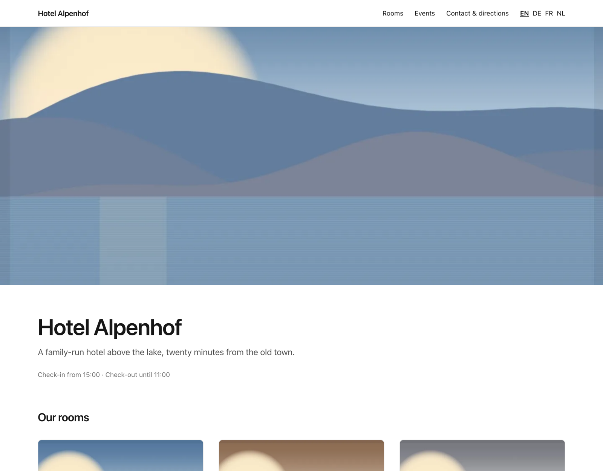
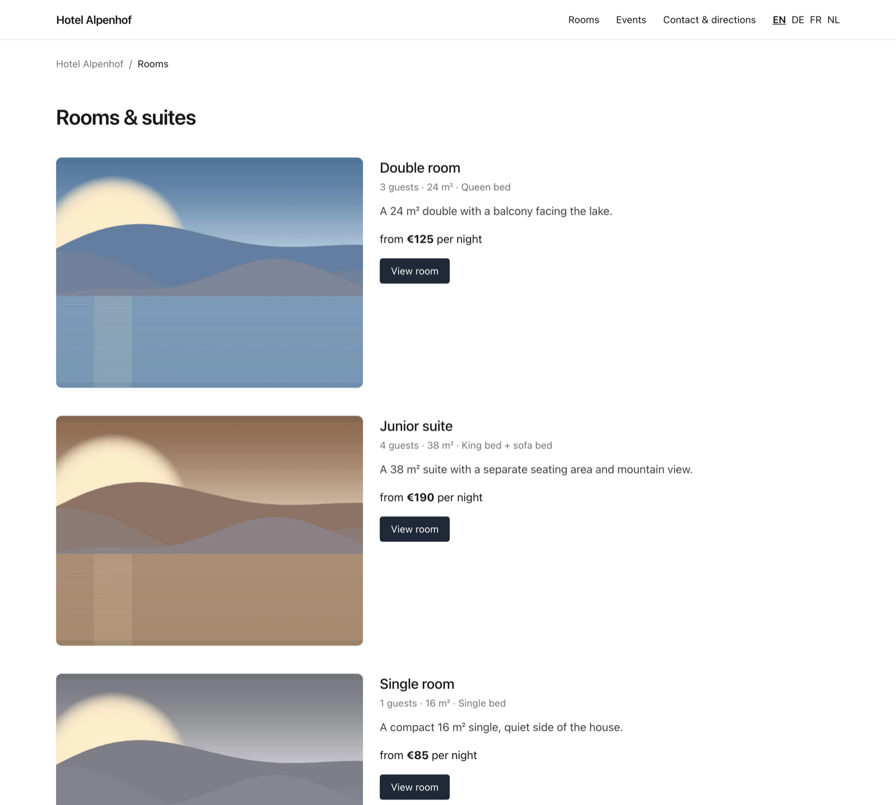
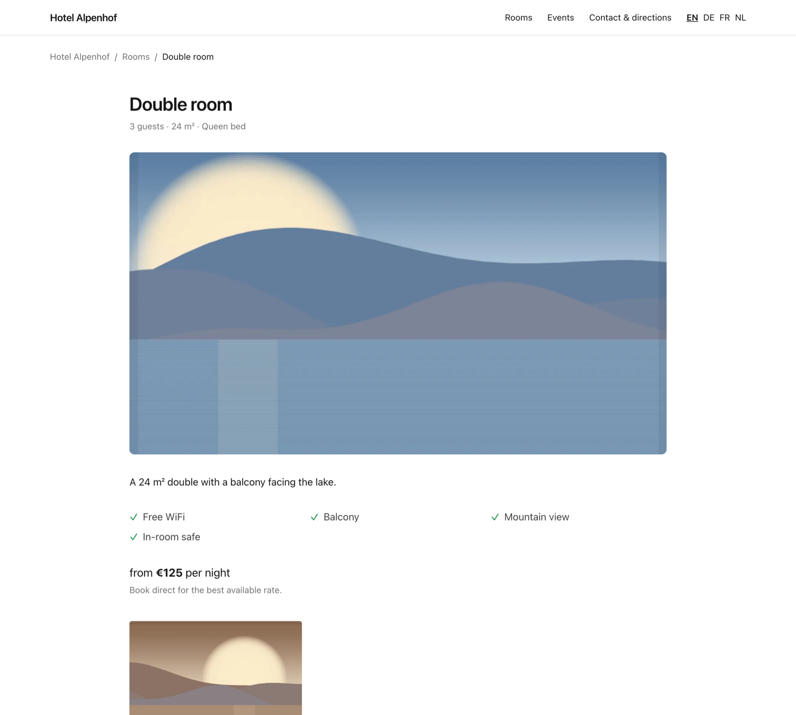
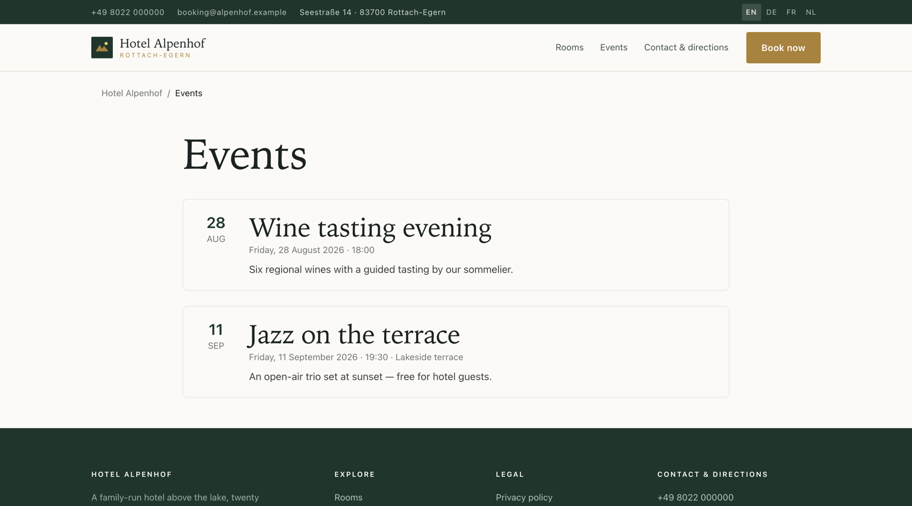
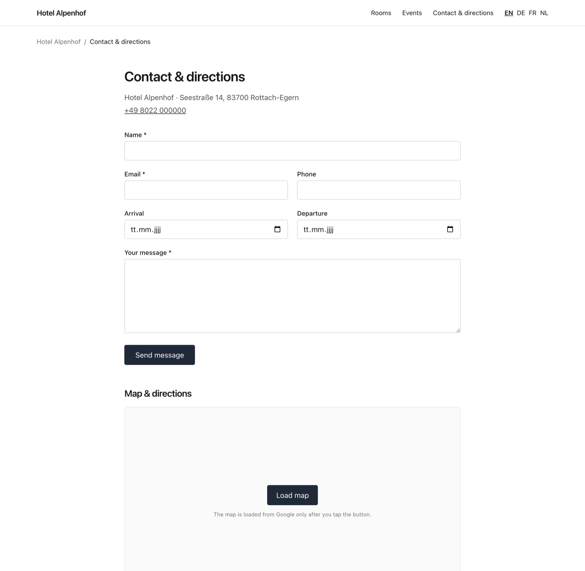

# Doba — direct-booking engine and website for independent hotels

[](https://github.com/gumslone/doba/actions/workflows/ci.yml)
[](LICENSE)

**Doba** is an open-source hotel booking system built on Laravel: a public,
multilingual, server-rendered website with a direct-booking engine, an
availability calendar, rate and restriction rules, online payments, OTA/channel
sync and a full admin panel.

It exists for one reason. An independent hotel pays Booking.com, Expedia or
Airbnb 15–18% commission on every reservation. A direct-booking site takes that
back — but only if it *ranks* and *converts*, which is why the SEO layer here is
a first-class subsystem rather than a meta tag bolted on at the end.

*doba* is the everyday word for one hotel night in Polish and Ukrainian.

> **Status: in progress.** Built so far: the multilingual SEO layer, the
> availability & rate engine, the booking core (holds, locking, state
> machine), **online payments** (Stripe, PayPal, LiqPay, crypto, manual),
> events, photo management with a maps block, and an interim admin with a
> WYSIWYG editor. Still to come: the guest checkout funnel, channel/OTA
> sync, the installation wizard, the public partner API and the full
> Filament panel — all specified in
> [`docs/architecture.md`](docs/architecture.md). See [Roadmap](#roadmap).
> The correctness-critical paths are covered by 145+ tests on both database
> engines, but the platform has not yet run a real hotel — treat it as
> pre-release.

---

## Screenshots

The demo hotel below is what `migrate --seed` produces — real rooms, rates,
events and four languages, rendered by the default theme.

| | |
|---|---|
| [](docs/screenshots/home.png)<br>**Home** — hero, rooms with "from" prices, upcoming events | [](docs/screenshots/rooms.png)<br>**Rooms** — the room list with occupancy and rates |
| [](docs/screenshots/room-detail.png)<br>**Room detail** — gallery, amenities, `HotelRoom` + `Offer` schema | [](docs/screenshots/events.png)<br>**Events** — dated happenings with `Event` schema |
| [](docs/screenshots/contact.png)<br>**Contact** — enquiry form, plus the click-to-load map | |

<sub>The photographs are generated by the demo seeder, not stock imagery — a
public repository can't ship licensed hotel photography, and a site with no
images hides every image bug. Replace them from **Admin → Photos**.</sub>

## Why this exists

| | Booking.com | A generic website builder | Doba |
|---|---|---|---|
| Commission per booking | 15–18% | 0% | 0% |
| Real availability & rates | ✅ | ❌ | ✅ |
| Ranks for "hotel *in your town*" | for *them* | maybe | that is the point |
| Guest data is yours | ❌ | ✅ | ✅ |
| Runs on €5/month hosting | — | — | ✅ (SQLite mode) |

---

## What is built today

### SEO layer

Everything below is implemented and covered by tests.

- **Per-locale URLs with translated path segments *and* translated slugs** —
  `/de/zimmer/doppelzimmer` and `/en/rooms/double-room` resolve to the same room
  type. The slug lives in the translation table, never on the parent record.
- **Reciprocal `hreflang` + `x-default`**, emitted in the page head *and* in the
  sitemap. A record that is translated into three of four languages gets exactly
  three alternates — a fallback-rendered page is never advertised as a
  translation.
- **Self-referencing canonical URLs**, query strings excluded, so `?utm_source=`
  cannot fork a page into a second indexable URL.
- **JSON-LD structured data**: `Hotel` (address, geo, amenities, check-in
  times), `HotelRoom`, `Offer` with price/currency/availability/validity,
  `BreadcrumbList`, `ItemList`, `WebSite`, `FAQPage`. Money is stored in integer
  minor units and converted at the boundary, so a €125 room is never published
  as `12500`.
- **Editable, translated FAQs** rendered on the home page with matching
  `FAQPage` markup — the structured data never describes questions the page
  doesn't visibly show.
- **Translated amenities** per room type, rendered on the room page and
  mirrored as `LocationFeatureSpecification` entries in the room's JSON-LD.
- **Contact form with enquiry storage** on a translated route (`/de/kontakt`,
  `/en/contact`): honeypot + timing check (spam is stored under its own
  status, never silently dropped, and the response never reveals detection),
  per-IP rate limiting, optional stay dates for quote requests, and a queued
  mail to the hotel inbox with reply-to set to the guest.
- **XML sitemap** with per-URL `xhtml:link` alternates, written nightly by
  `php artisan doba:sitemap` and generated live as a fallback.
- **`robots.txt` from the same flag as the meta robots tag** — a staging install
  cannot be `noindex` in HTML and crawlable in `robots.txt` at the same time.
  Crawlers are kept out of the booking funnel, where crawling would manufacture
  inventory holds.
- **Legacy-URL redirects** from a database table, resolved on 404 (no query on
  the happy path) and preserving the query string, so a hotel migrating from an
  old site keeps its rankings and its campaign attribution.
- **Core Web Vitals defaults**: intrinsic `width`/`height` on every image to
  prevent layout shift, WebP `srcset`/`sizes` capped at the source's real width,
  eager + `fetchpriority=high` on the LCP image and lazy on everything else,
  no third-party origins in the critical path.
- **Photo management** for every room type and the house gallery: uploads are
  stored under a random name, measured, and turned into WebP derivatives at
  upload time (never on the visitor's request); per-locale alt text; exactly
  one cover, always — deleting the cover promotes the next photo, and deleting
  a photo removes its derivatives with it.
- **Google Maps, click-to-load.** Nothing is requested from Google until the
  visitor presses the button, so the map costs no third-party request on
  arrival and the privacy policy stays short. `hasMap` and `GeoCoordinates`
  go into the `Hotel` structured data either way.
- **Events** with per-locale slugs (`/de/veranstaltungen/weinverkostung`),
  an upcoming-events section on the front page, and `schema.org/Event`
  markup with the hotel as the default venue — one of the few SERP features
  an independent hotel can win that an OTA listing cannot.
- **A visible breadcrumb trail that matches the structured one**, a language
  switcher that points at the current page in each language rather than the home
  page, and one `<h1>` per page.

### Booking engine

- **Availability** as one row per room type per night, with a raw-DDL `CHECK`
  constraint (`booked + held <= allotment`) as the last line of defence
  against overselling on both MySQL and SQLite.
- **Correct restriction handling**: min/max-stay and closed-to-arrival on the
  arrival night only, closed-to-departure on the checkout night only,
  `min_stay_through`, occupancy limits, multi-room composition. A missing row
  is unbookable, never "assume available".
- **Rate resolution**: per-date override → season rate (priority + weekday
  bitmask) → default rate, frozen per night into the booking so a confirmed
  price never moves.
- **Double-booking prevention** via `lockForUpdate` inside the booking
  transaction — and on SQLite via a mandatory `BEGIN IMMEDIATE` connection so
  concurrent bookings genuinely serialise rather than throwing `SQLITE_BUSY`.
  The concurrency test proves exactly one of two racers wins.
- **Holds & a state machine** where inventory is released by the status being
  *entered*, so no path can leak a unit; expired holds are swept every minute.
- A public **calendar JSON endpoint** for the date picker.

### Payments

- A `PaymentGateway` contract with **Stripe**, **PayPal**, **LiqPay**
  (Ukraine/PrivatBank), **Coinbase Commerce** (crypto) and a **manual**
  (bank-transfer / pay-on-arrival) implementation — all over Laravel's HTTP
  client, no SDK dependencies, fully faked in tests.
- **The webhook is the source of truth, never the browser redirect.** Every
  handler verifies the provider's signature (and fails *closed* if the signing
  secret is unset), is idempotent on the gateway payment id, and re-acquires
  inventory under lock before confirming.
- **The late-webhook trap is handled**: a payment that lands after the hold
  expired and the room was resold is auto-refunded (or, for crypto that can't
  refund via API, released and flagged for a manual refund) — never confirmed
  into an overbooking.
- Partial and full **refunds** with correct `paid_amount` / `balance_due`
  bookkeeping; refunds are their own rows so the ledger reconstructs a dispute.

### Security (§14)

- Response headers on every route: CSP, `X-Content-Type-Options`,
  `X-Frame-Options`, `Referrer-Policy`, `Permissions-Policy`, and HSTS over
  HTTPS.
- HTTPS forced in production so canonical URLs and redirects never emit
  `http://`; secure-cookie and CSRF handling; webhook routes are CSRF-exempt
  but signature-authenticated instead.
- Public forms carry a honeypot + timing check and per-IP rate limits; admin
  login is throttled. Money is integer minor units end to end.
- The branch ships with an adversarial security review on record (fail-open
  webhook verification found and fixed before merge).

### Platform

- Locale resolution: URL prefix → session → `Accept-Language` → `APP_LOCALE`,
  with an optional prefix-less default locale (the prefixed form then 301s).
- Two-layer translation: interface strings in `lang/`, content in
  `*_translations` tables edited by the hotelier.
- Theme layer — `resources/views/themes/<slug>` overrides `default` file by
  file; branding is *settings*, not theme files.
- Settings service cached across requests, exposed to every view as `$hotel`.
- Portable schema: identical migrations on **MySQL 8** and **SQLite 3.35+**,
  money as `bigInteger` minor units, no `ENUM`, no stored procedures.

---

## Requirements

- PHP 8.4+ with `pdo_mysql`, `pdo_sqlite`, `mbstring`, `intl`, `gd`, `zip`,
  `curl`, `openssl` — 8.4 is a hard floor: the SQLite `BEGIN IMMEDIATE`
  transaction mode the booking engine's locking depends on requires it
- Composer 2, Node 20 (build-time only)
- MySQL 8 **or** SQLite 3.35+
- Apache 2.4 with `mod_rewrite` + php-fpm in production (see
  [`docs/architecture.md` §15](docs/architecture.md))

## Quick start

```bash
git clone https://github.com/gumslone/doba.git && cd doba
composer install
cp .env.example .env && php artisan key:generate
touch database/database.sqlite
php artisan migrate --seed
npm install && npm run build
php artisan serve
```

Then open `http://127.0.0.1:8000/` — it content-negotiates to
`/en`, `/de`, `/fr` or `/nl`. The seeder creates a demo hotel whose junior suite
is deliberately *not* translated into Dutch, so the `hreflang` set, the language
switcher and the sitemap all have a real partial translation to show.

Useful URLs on the running site:

| URL | What it shows |
|---|---|
| `/de/zimmer/doppelzimmer` | room page: hreflang, canonical, `HotelRoom` + `Offer` JSON-LD |
| `/nl/kamers/junior-suite` | 404 — untranslated, and deliberately not served under a fallback |
| `/sitemap.xml` | every translated URL with reciprocal alternates |
| `/robots.txt` | funnel disallows + sitemap reference |

## Commands

```bash
php artisan doba:sitemap    # regenerate public/sitemap.xml (nightly in production)
```

```bash
php artisan doba:images     # generate WebP srcset derivatives + backfill image dimensions
```

## Tests, style, static analysis

```bash
php artisan test
```

```bash
vendor/bin/pint --test && vendor/bin/phpstan analyse --memory-limit=1G
```

CI runs the suite against **both SQLite and MySQL** on every push — that matrix
is the only thing that keeps the "portable" promise honest.

## Admin & editing

An interim admin area lives at `/admin` (the full Filament panel replaces it
later in phase 1). It edits **CMS pages**, **events** and **photos** with
per-language tabs and a [Trix](https://trix-editor.org) WYSIWYG editor — clearing a
language's title unpublishes that language: its URL, `hreflang` entry and
sitemap line all disappear together. The demo seeder creates
`admin@example.com` / `password` (override with `DOBA_ADMIN_EMAIL` /
`DOBA_ADMIN_PASSWORD` before seeding anything public-facing).

## Theming & custom styles

Two layers, deliberately separate:

1. **Styles are settings.** `/admin/styles` edits brand colours, heading/body
   fonts and free-form custom CSS, stored in the database and emitted as CSS
   variables (`--doba-primary`, `--doba-accent`, `--doba-font-*`) on every
   public page. Fonts are a curated list of system stacks, so no webfont ever
   enters the critical path. Custom CSS is applied after the theme stylesheet;
   `<` is escaped on output so it cannot break out of its style block.
2. **Themes are structure.** Set `DOBA_THEME=<name>` and create
   `resources/views/themes/<name>/`; any Blade file placed there overrides the
   same path in `themes/default`, file by file, everything else falls through.
   A theme override is for layout changes — the moment a theme exists only to
   change a colour, it should have been a setting.

## Configuration

Per-install settings live in `.env` (see `.env.example` for the full `DOBA_*`
block); feature flags live in [`config/doba.php`](config/doba.php). Anything a
hotelier should be able to change themselves — address, policies, texts,
colours, images, room descriptions — belongs in the database, not here.

```ini
DOBA_LOCALES=en,de,fr,nl        # first entry is the default locale
DOBA_HIDE_DEFAULT_PREFIX=false  # serve the default locale at / instead of /en
DOBA_NOINDEX=false              # true on staging: noindex + Disallow: / together
DOBA_SCHEMA_TYPE=Hotel          # or Resort, BedAndBreakfast, …
PAYMENT_GATEWAY=manual          # stripe | paypal | liqpay | coinbase | manual
```

### Payment providers

Set `PAYMENT_GATEWAY` to the default and fill the matching keys in `.env`
(`STRIPE_*`, `PAYPAL_*`, `LIQPAY_*`, `COINBASE_COMMERCE_*`). `manual` takes
bookings without online payment — a legitimate starting configuration. Every
configured provider's `POST /webhooks/<name>` endpoint stays live regardless of
the default, so switching gateways never orphans events for payments taken
under the old one. Point each provider's dashboard at:

```
https://<your-domain>/webhooks/stripe
https://<your-domain>/webhooks/paypal
https://<your-domain>/webhooks/liqpay
https://<your-domain>/webhooks/coinbase
```

## Architecture

One shared codebase, **one install per hotel** — its own domain, `.env`,
database and uploads directory. Maximum isolation and per-hotel backup/restore,
at the cost of per-install maintenance, which is absorbed by three rules: nothing
hotel-specific is ever hard-coded, all installs share one release artifact, and
per-hotel customisation is data and theme — never a code fork.

The full design, including the availability engine, the double-booking locking
strategy on both database engines, payments, channel sync, the installation
wizard and the public API, is in
**[`docs/architecture.md`](docs/architecture.md)**.

## Roadmap

| Phase | Scope | State |
|---|---|---|
| 1 | Foundation: config/theme layer, content model, i18n routing, **SEO layer**, CI | **done** |
| 2 | Availability service, rate engine, holds + locking + reconciliation, calendar API | **done** · checkout funnel + admin availability grid next |
| 3 | Payments (Stripe/PayPal/LiqPay/crypto/manual, webhook-driven, refunds) | **done** · invoices, extras, promo codes next |
| — | Events, WYSIWYG admin, customizable styles, security headers | **done** |
| 4 | First hotel live | planned |
| 5 | iCal two-way channel sync, reports, multi-install deploy | planned |
| 6 | Public REST API + webhooks, OpenAPI docs | planned |

## Contributing

Issues and pull requests are welcome. Before opening a PR, run
`vendor/bin/pint`, `vendor/bin/phpstan analyse --memory-limit=1G` and
`php artisan test`. Changes to routing, `hreflang`, canonicals, the sitemap or
structured data need a test — those are the parts that fail silently.

## Licence

[MIT](LICENSE).

---

<sub>Keywords: hotel booking system, direct booking engine, Laravel hotel
software, PMS, channel manager, iCal sync, multilingual hotel website,
availability calendar, rate management, hotel SEO, schema.org Hotel, hreflang,
open source booking engine.</sub>
